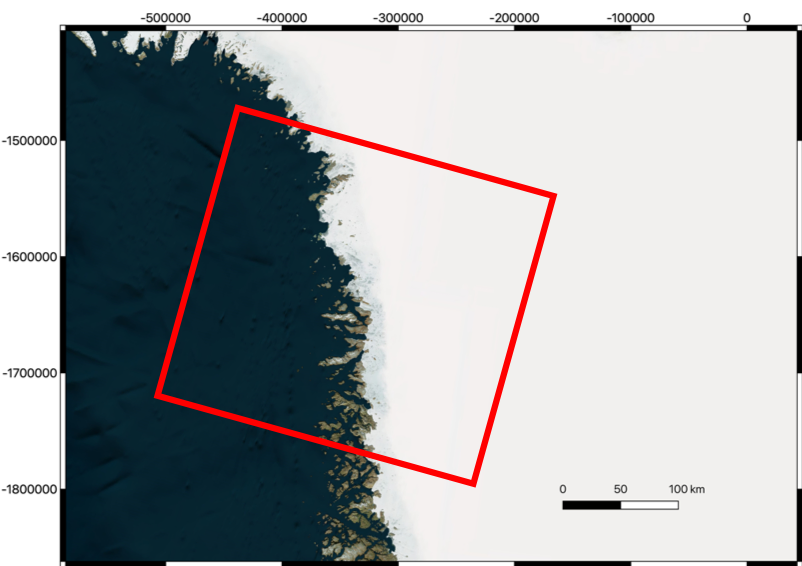
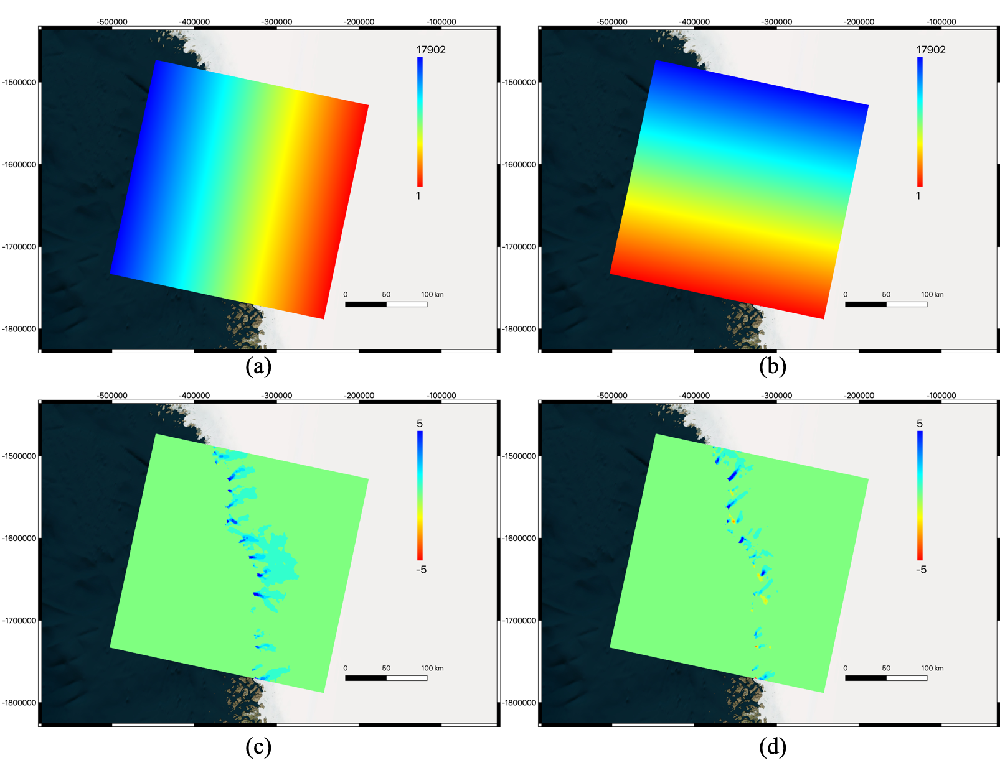

# Geogrid

**A Python module for precise mapping between (pixel index, pixel displacement) in imaging coordinates and (geolocation, motion velocity) in geographic Cartesian (northing/easting) coordinates**

**Geogrid can be installed as a standalone Python module (only supports Cartesian coordinates) either manually or as a conda install (https://github.com/conda-forge/autorift-feedstock). To allow support for both Cartesian and radar coordinates, Geogrid must be installed with the InSAR Scientific Computing Environment (ISCE: https://github.com/isce-framework/isce2)**

**Geogrid can be used for dense feature tracking between two images over a grid defined in an arbitrary geographic Cartesian (northing/easting) coordinate projection when used in combination with the sister autoRIFT Python module (https://github.com/leiyangleon/autoRIFT). Example applications include searching radar-coordinate imagery on a polar stereographic grid and searching Universal Transverse Mercator (UTM) imagery at a specified geographic Cartesian (northing/easting) coordinate grid**

Copyright (C) 2019 California Institute of Technology.  Government Sponsorship Acknowledged.

Link: https://github.com/leiyangleon/Geogrid

## 1. Authors

Piyush Agram (JPL/Caltech; piyush.agram@jpl.nasa.gov), Yang Lei (GPS/Caltech; ylei@caltech.edu)

## 2. Acknowledgement

This effort was funded by the NASA MEaSUREs program in contribution to the Inter-mission Time Series of Land Ice Velocity and Elevation (ITS_LIVE) project (https://its-live.jpl.nasa.gov/) and through Alex Gardner’s participation in the NASA NISAR Science Team
       
       
## 3. Features

* user can define a grid in geographic Cartesian (northing/easting) coordinates provided in the form of a Digital Elevation Model (DEM) with arbitrary EPSG projection code (but has to be in northing/easting; lat/lon won't work), 
* the program will extract the portion of the grid that overlaps with the given co-registered image pair, 
* for radar-coordinate imagery, use radar orbit information plus DEM along with GDAL coordinate transformation to precisely map the geolocation and the motion velocity at each grid point (in geographic Cartesian coordinates) to the corresponding pixel index and pixel displacement (in imaging coordinates), where the imaging along-track and line-of-sight unit vectors are precisely derived at each grid point
* for Cartesian-coordinate imagery, use map coordinate information of the image pair along with GDAL coordinate transformation to precisely map the geolocation and the motion velocity at each grid point (in geographic Cartesian coordinates) to the corresponding pixel index and pixel displacement (in imaging coordinates), where the imaging horizontal- and vertical-direction unit vectors are precisely derived at each grid point
* the geographic z-direction motion velocity is estimated using the irrotational flow assumption as well as inputs from the geographic x- (easting) and y- (northing) direction motion velocity maps and the geographic x- (easting) and y- (northing) direction local surface slope maps
* return the pixel indices in the image pair for each grid point
* return the pixel displacement given the motion velocity maps and the local surface slope maps in the direction of both geographic x- (easting) and y- (northing) coordinates (they must be provided at the same grid as the DEM)
* return the matrix of conversion coefficients that can convert the fine pixel displacement between the two images (estimated with the autoRIFT Python module https://github.com/leiyangleon/autoRIFT) to motion velocity in geographic x- (easting) and y- (northing) coordinates
* the current version can be installed with the ISCE software (that supports both radar and Cartesian coordinates) or as a standalone Python module (Cartesian coordinates only)
* when used in combination with the autoRIFT Python module (https://github.com/leiyangleon/autoRIFT), Geogrid can be used for feature tracking between image pair over a grid defined in an arbitrary geographic Cartesian (northing/easting) coordinate projection
* outputs are returned in geocoded GeoTIFF image file format with the same EPSG projection code as input search grid
* spatially varying input maps of velocity search range (in units of m/yr), chip size minimum and maximum (in units of m), stable surface mask (boolean) can be handled, with corresponding output (in units of integer image pixels) returned at each grid point.
* **[NEW]** For feature tracking of optical images, the program now supports fetching optical images (Landsat-8 GeoTIFF and Sentinel-2 COG formats are included) as well as other inputs (e.g. DEM, slope, etc; all in GeoTIFF format) from either local machine or URL links. See the changes on the autoRIFT [commands](https://github.com/leiyangleon/autoRIFT). When using the Geogrid commands below, users need to append a url flag: "-urlflag 1" for using URL links and performing coregistration, "-urlflag 0" for using files on local machine and performing coregistration. If the flag is not specified (default), it will behave the same as previous versions, i.e. using files on local machine without coregistration (assuming they are already coregistered). For feature tracking of radar images, the program also supports fetching auxilliary inputs (e.g. DEM, slope, etc; all in GeoTIFF format) from either local machine or URL links, i.e. "-urlflag 1" for using URLs and not specified (default) for local files.

## 4. Demo

_4.1 Radar Demo:_

***Test area and dataset: optical image over the Jakobshavn glacier where the red rectangle marks boundary of the Sentinel-1A/B image pair (20170221-20170227). Input files in this test scenario consist of the Digital Elevation Model (DEM), local surface slope maps (in both x- and y-direction) and motion velocity maps (in both x- and y-direction) over the entire Greenland, where all maps share the same geographic Cartesian (northing/easting) coordinate grid with 240-m spacing and spatial reference system with EPSG code 3413 (a.k.a WGS 84 / NSIDC Sea Ice Polar Stereographic North).***

***Output of "Geogrid" module: (a) range pixel index at each grid point, (b) azimuth pixel index at each grid point, (c) range pixel displacement at each grid point, (d) azimuth pixel displacement at each grid point. Note: only the portion of the grid overlapping with the radar image pair has been extracted and shown.***

This is obtained by implementing the following command line:

With ISCE:

       testGeogrid_ISCE.py -m master_image_folder -s slave_image_folder -d demname -sx dhdxname -sy dhdyname -vx vxname -vy vyname -srx srxname -sry sryname -csminx csminxname -csminy csminyname -csmaxx csmaxxname -csmaxy csmaxyname -ssm ssmname

where "master_image_folder" and "slave_image_folder" are the folders storing master and slave image information (e.g. radar parameters), and "demname", "dhdxname", "dhdyname", "vxname", "vyname", "srxname", "sryname", "csminxname", "csminyname", "csmaxxname", "csmaxyname" and "ssmname" are defined below in the instructions.

Using the matrix of conversion coefficients, when fine pixel displacement are estimated from radar data, they can be immediately converted to motion velocity. See the final result below by using the matrix of conversion coefficients from the "Geogrid" module and the radar-estimated fine pixel displacement from the "autoRIFT" module (https://github.com/leiyangleon/autoRIFT).

***Final motion velocity results by combining outputs from "Geogrid" and "autoRIFT" modules: (a) estimated motion velocity from Sentinel-1 data (x-direction; in m/yr), (b) motion velocity from input data (x-direction; in m/yr), (c) estimated motion velocity from Sentinel-1 data (y-direction; in m/yr), (d) motion velocity from input data (y-direction; in m/yr). Notes: all maps are established exactly over the same geographic Cartesian (northing/easting) coordinate grid from input.***

_4.2 Optical Demo:_

***Test area and dataset: optical image over Greenland (to the north of the Jakobshavn glacier) where the red rectangle marks boundary of the Landsat-8 image pair (20170708-20170724; in UTM coordinates). Input files in this test scenario consist of the Digital Elevation Model (DEM), local surface slope maps (in both x- and y-direction) and motion velocity maps (in both x- and y-direction) over the entire Greenland, where all maps share the same geographic Cartesian (northing/easting) coordinate grid with 240-m spacing and spatial reference system with EPSG code 3413 (a.k.a WGS 84 / NSIDC Sea Ice Polar Stereographic North).***

***Output of "Geogrid" module: (a) horizontal pixel index at each grid point, (b) vertical pixel index at each grid point, (c) horizontal pixel displacement at each grid point, (d) vertical pixel displacement at each grid point. Note: only the portion of the grid overlapping with the optical image pair has been extracted and shown.***

This is obtained by implementing the following command line:

With ISCE:

       testGeogrid_ISCE.py -m image1 -s image2 -d demname -sx dhdxname -sy dhdyname -vx vxname -vy vyname -srx srxname -sry sryname -csminx csminxname -csminy csminyname -csmaxx csmaxxname -csmaxy csmaxyname -ssm ssmname -fo 1

Standalone:

       testGeogridOptical.py -m image1 -s image2 -d demname -sx dhdxname -sy dhdyname -vx vxname -vy vyname -srx srxname -sry sryname -csminx csminxname -csminy csminyname -csmaxx csmaxxname -csmaxy csmaxyname -ssm ssmname

where "image1" and "image2" are the optical images with map coordinate information (e.g. projection, coordinates), and "demname", "dhdxname", "dhdyname", "vxname", "vyname", "srxname", "sryname", "csminxname", "csminyname", "csmaxxname", "csmaxyname" and "ssmname" are defined below in the instructions. The "-fo" option of "testGeogrid_ISCE.py" indicates whether or not to read optical image data.

Using the matrix of conversion coefficients, when fine pixel displacement are estimated from optical data, they can be immediately converted to motion velocity. See the final result below by using the matrix of conversion coefficients from the "Geogrid" module and the optical data-estimated fine pixel displacement from the "autoRIFT" module (https://github.com/leiyangleon/autoRIFT).

***Final motion velocity results by combining outputs from "Geogrid" and "autoRIFT" modules: (a) estimated motion velocity from Landsat-8 data (x-direction; in m/yr), (b) motion velocity from input data (x-direction; in m/yr), (c) estimated motion velocity from Landsat-8 data (y-direction; in m/yr), (d) motion velocity from input data (y-direction; in m/yr). Notes: all maps are established exactly over the same geographic Cartesian (northing/easting) coordinate grid from input.***

## 6. Install

Please refer to the installation guide of autoRIFT repository (https://github.com/leiyangleon/autoRIFT) for installing the Geogrid module.

## 5. Instructions

**Note:**

* For radar-coordinate imagery, it is recommended to run ISCE up to the step where co-registered SLC's are done, e.g. "mergebursts" for using topsApp.
* For Cartesian-coordinate imagery, the images have to be co-registered with the same posting as well as the same x- and y-limits in map coordinates.
* The input DEM grid along with the auxilliary files have to be in the geographic Cartesian coordinate projection (with geographic x, y coordinates being easting, northing defined as distances in units of m); the geographic coordinate system (with latitude and longitude) is not supported. Users are recommended to do the GDAL coordinate transformation themselves before using the current version of the Geogrid module.

**For quick use:**

_Radar-coordinate Imagery:_
* Refer to the file "testGeogrid_ISCE.py" (with ISCE) for the usage of the module and modify it for your own purpose
* Input files include the master image folder (required), slave image folder (required), a DEM (required; in units of m), local surface slope maps (unitless), velocity maps (in units of m/yr), velocity search range maps (in units of m/yr), chip size minimum/maximum maps (in units of m), stable surface mask.
* Output files include 1) the range and azimuth pixel indices (in units of integer image pixels), 2) the range and azimuth pixel displacement (in units of integer image pixels), 3) the range and azimuth search range (in units of integer image pixels), 4) the range and azimuth chip size minimum (in units of integer image pixels), 5) the range and azimuth chip size maximum (in units of integer image pixels), 6) the stable surface mask (boolean), 7) the conversion coefficients from radar range and azimuth displacement to motion velocity in geographic x-coordinate, and 8) the conversion coefficients from radar range and azimuth displacement to motion velocity in geographic y-coordinate. 

_Cartesian-coordinate Imagery:_
* Refer to the file "testGeogrid_ISCE.py" (with ISCE) and "testGeogridOptical.py" (standalone) for the usage of the module and modify it for your own purpose
* Input files include the image 1 (required), image 2 (required), a DEM (required; in units of m), local surface slope maps (unitless), velocity maps (in units of m/yr)
* Output files include 1) the horizontal and vertical pixel indices (in units of integer image pixels), 2) the horizontal and vertical pixel displacement (in units of integer image pixels), 3) the horizontal and vertical search range (in units of integer image pixels), 4) the horizontal and vertical chip size minimum (in units of integer image pixels), 5) the horizontal and vertical chip size maximum (in units of integer image pixels), 6) the stable surface mask (boolean), 3) the conversion coefficients from horizontal and vertical displacement to motion velocity in geographic x-coordinate, and 4) the conversion coefficients from horizontal and vertical displacement to motion velocity in geographic y-coordinate. 

_Note: among these, 1) will always be created, while 2) and 7-8) will be generated contingent upon that local surface slope and velocity maps are provided. The rest, i.e. 3-6) will be created only when the corresponding inputs are provided._

**For modular use:**

* In Python environment, type the following to import the "Geogrid" module and initialize the "Geogrid" object

_With ISCE:_

       import isce
       from contrib.geo_autoRIFT.geogrid import Geogrid, GeogridOptical
       obj = Geogrid() or obj = GeogridOptical()
       obj.configure()

_Standalone:_

       from geogrid import GeogridOptical
       obj = GeogridOptical()

where "Geogrid()" is for radar-coordinate imagery and "GeogridOptical()" for Cartesian-coordinate imagery.

* The "Geogrid" object has several parameters that have to be set up (listed below; can also be obtained by referring to "testGeogrid_ISCE.py"): 

       ------------------radar-coordinate imagery parameters (for radar only)------------------
       startingRange:       starting range
       rangePixelSize:      range pixel size
       sensingStart:        starting azimuth time
       prf:                 pulse repition frequency 
       lookSide:            look side, e.g. -1 for right looking 
       repeatTime:          time period between the acquisition of the two radar images
       numberOfLines:       number of lines (in azimuth)
       numberOfSamples:     number of samples (in range)
       orbit:               ISCE orbit data structure
       
       ------------------Cartesian-coordinate imagery parameters (for Cartesian only)------------------
       startingX:           starting coordinate in x direction
       startingY:           starting coordinate in y direction
       XSize:               resolution in x direction
       YSize:               resolution in y direction
       repeatTime:          time period between the acquisition of the two optical images
       numberOfLines:       number of lines (in y direction)
       numberOfSamples:     number of samples (in x direction)
       
       ------------------MISC------------------
       nodata_out:          nodata value in the output
       chipSizeX0:          Smallest chip size allowed (in m), which only gets used when the chip size minimum and maximum are provided.
       
       ------------------input file names------------------
       demname:             (input; required) file path/name of the DEM
       dhdxname:            (input; not required) file path/name of the local surface slope in geographic x- (easting) coodinate
       dhdyname:            (input; not required) file path/name of the local surface slope in geographic y- (northing) coodinate
       vxname:              (input; not required) file path/name of the motion velocity in geographic x- (easting) coodinate
       vyname:              (input; not required) file path/name of the motion velocity in geographic y- (northing) coodinate
       srxname:             (input; not required) file path/name of the velocity search range in geographic x- (easting) coodinate
       sryname:             (input; not required) file path/name of the velocity search range in geographic y- (northing) coodinate
       csminxname:          (input; not required) file path/name of the chip size minimum (in m) in geographic x- (easting) coodinate
       csminyname:          (input; not required) file path/name of the chip size minimum (in m) in geographic y- (northing) coodinate
       csmaxxname:          (input; not required) file path/name of the chip size maximum (in m) in geographic x- (easting) coodinate
       csmaxyname:          (input; not required) file path/name of the chip size maximum (in m) in geographic y- (northing) coodinate
       ssmname:             (input; not required) file path/name of the stable surface mask
       
       
       ------------------output file names------------------
       winlocname:          (output) file name for the two-band (in x and y-direction) pixel indices (at each grid point)
       winoffname:          (output) file name of the two-band (in x and y-direction) pixel displacement (at each grid point)
       winsrname:           (output) file name of the two-band (in x and y-direction) pixel search range (at each grid point)
       wincsminname:        (output) file name of the two-band (in x and y-direction) chip size minimum in pixels (at each grid point)
       wincsmaxname:        (output) file name of the two-band (in x and y-direction) chip size maximum in pixels (at each grid point)
       winssmname:          (output) file name of the stable surface mask (at each grid point)
       winro2vxname:        (output) file name of the two-band (in x and y-direction) conversion coefficients from pixel displacement to motion velocity in geographic x-coordinate (at each grid point)
       winro2vyname:        (output) file name of the two-band (in x and y-direction) conversion coefficients from pixel displacement to motion velocity in geographic y-coordinate (at each grid point)
       
       
       Note: all the above outputs will be created. However, when "dhdxname" and "dhdyname" are not provided, "winoffname", "winro2vxname" and "winro2vyname" will be nodata everywhere; when "vxname", and "vyname" are not provided, "winoffname" will be nodata everywhere; only when all of "dhdxname", "dhdyname", "vxname", and "vyname" are provided, these four outputs ("winlocname", "winoffname", "winro2vxname" and "winro2vyname") have meaningful values. In addition, "winsrname" is meaningful when "srname" is provided; "wincsminname" is meaningul when "csminxname" and "csminyname" are provided; "wincsmaxname" is meaningul when "csmaxxname" and "csmaxyname" are provided; "winssmname" is meaningful when "ssmname" is provided. Otherwise, there will be nodata values as assigned by "nodata_out" everywhere in the outputs.

* After the above parameters are set, run the module as below to create the output files

       obj.geogrid() or obj.runGeogrid()

where "obj.geogrid()" is for radar-coordinate imagery, and "obj.runGeogrid()" for Cartesian-coordinate imagery.
