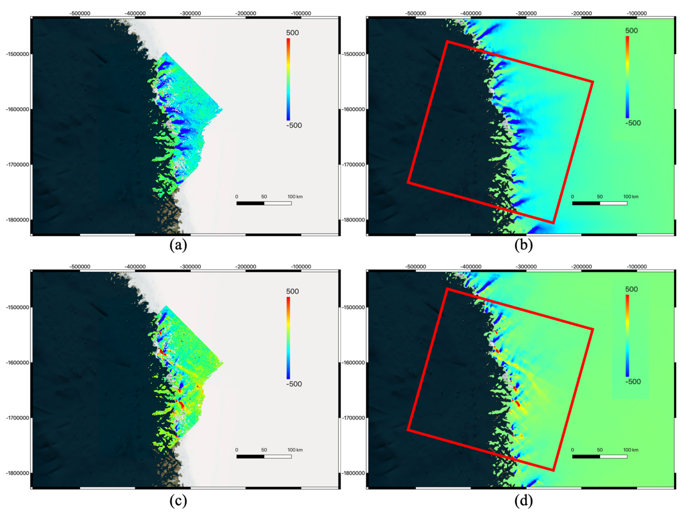

_4.2 Optical Demo_

***Test area and dataset: optical image over Greenland (to the north of the Jakobshavn glacier) where the red rectangle marks boundary of the Landsat-8 image pair (20170708-20170724; in UTM coordinates). Input files in this test scenario consist of the Digital Elevation Model (DEM), local surface slope maps (in both x- and y-direction) and motion velocity maps (in both x- and y-direction) over the entire Greenland, where all maps share the same geographic Cartesian (northing/easting) coordinate grid with 240-m spacing and spatial reference system with EPSG code 3413 (a.k.a WGS 84 / NSIDC Sea Ice Polar Stereographic North).***

***Output of "Geogrid" module: (a) horizontal pixel index at each grid point, (b) vertical pixel index at each grid point, (c) horizontal pixel displacement at each grid point, (d) vertical pixel displacement at each grid point. Note: only the portion of the grid overlapping with the optical image pair has been extracted and shown.***

This is obtained by implementing the following command line:

With ISCE:

       testGeogrid_ISCE.py -m image1 -s image2 -d demname -sx dhdxname -sy dhdyname -vx vxname -vy vyname -srx srxname -sry sryname -csminx csminxname -csminy csminyname -csmaxx csmaxxname -csmaxy csmaxyname -ssm ssmname -fo 1

Standalone:

       testGeogridOptical.py -m image1 -s image2 -d demname -sx dhdxname -sy dhdyname -vx vxname -vy vyname -srx srxname -sry sryname -csminx csminxname -csminy csminyname -csmaxx csmaxxname -csmaxy csmaxyname -ssm ssmname

where "image1" and "image2" are the optical images with map coordinate information (e.g. projection, coordinates), and "demname", "dhdxname", "dhdyname", "vxname", "vyname", "srxname", "sryname", "csminxname", "csminyname", "csmaxxname", "csmaxyname" and "ssmname" are defined below in the instructions. The "-fo" option of "testGeogrid_ISCE.py" indicates whether or not to read optical image data.

Using the matrix of conversion coefficients, when fine pixel displacement are estimated from optical data, they can be immediately converted to motion velocity. See the final result below by using the matrix of conversion coefficients from the "Geogrid" module and the optical data-estimated fine pixel displacement from the "autoRIFT" module (https://github.com/leiyangleon/autoRIFT).

***Final motion velocity results by combining outputs from "Geogrid" and "autoRIFT" modules: (a) estimated motion velocity from Landsat-8 data (x-direction; in m/yr), (b) motion velocity from input data (x-direction; in m/yr), (c) estimated motion velocity from Landsat-8 data (y-direction; in m/yr), (d) motion velocity from input data (y-direction; in m/yr). Notes: all maps are established exactly over the same geographic Cartesian (northing/easting) coordinate grid from input.***
